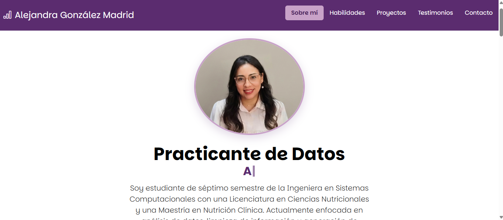
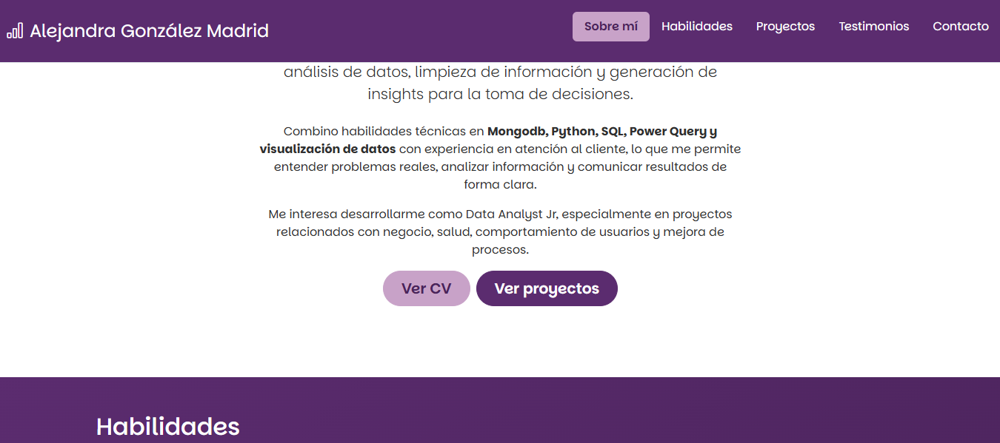
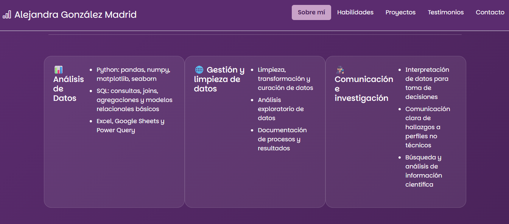

## Portafolio de proyectos

¡Hola! ***Soy Alejandra González***, soy estudiante de séptimo semestre de la Ingeniería en Sistemas Computacionales con una Licenciatura en Ciencias Nutricionales y una Maestría en Nutrición Clínica. Actualmente enfocada en análisis de datos y limpieza de información, aquí encontrarás información sobre mí. 

______
### El proyecto cuenta con las secciones de:

- 🤓 Sobre mí
- 💪🏽 Habilidades 
- 📋 Proyectos
- 👩🏽 Testimonios
- 📪 Contacto

### Creado con:
- HTML
- CSS
- JavaScript

### Vista Previa    

### Link
https://alejandra-go.github.io/

### *Espero pronto saber de ti*
*Correo*
[alejandrag89@hotmail.com](mailto:alejandrag89@hotmail.com)

### Creado en el bootcamp de TecnolochicasPro 💜
[Tecnolochicas](https://tecnolochicas.mx/)
