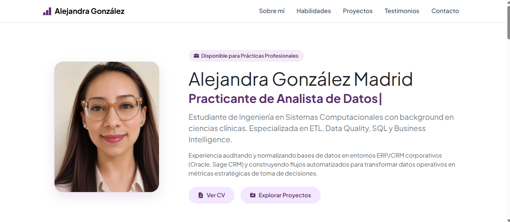
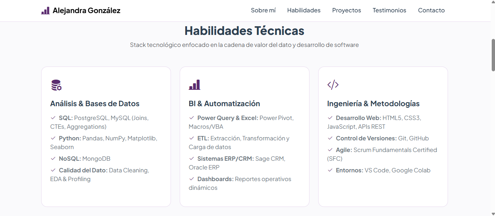
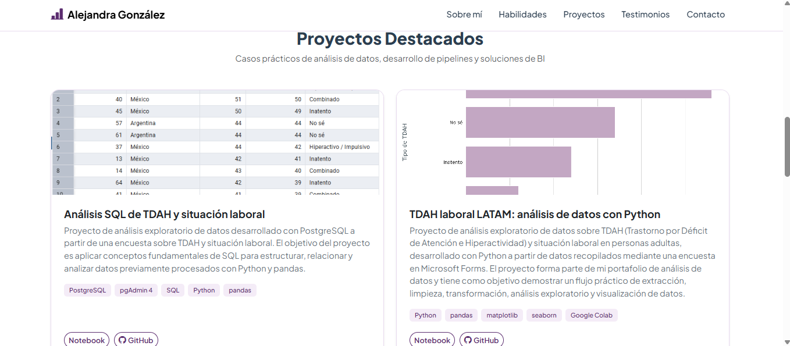

# 📊 Portafolio Profesional — Alejandra González Madrid

¡Hola! Soy **Alejandra González Madrid**, estudiante de Ingeniería en Sistemas Computacionales con trasfondo profesional en ciencias clínicas. Me especializo en la auditoría, limpieza, ingeniería de datos (ETL) y Business Intelligence.

🌐 **Sitio Web:** [alejandra-go.github.io](https://alejandra-go.github.io/)

--- 

## 🚀 Sobre este Proyecto

Este repositorio contiene mi portafolio web personal, donde presento mis proyectos analíticos, competencias técnicas y trayectoria profesional.

### 📌 Secciones del Sitio:
- 🤓 **Sobre mí:** Trayectoria, formación y enfoque analítico.
- 💪🏽 **Habilidades:** Stack técnico en datos y desarrollo web.
- 📋 **Proyectos:** Casos prácticos de ETL, SQL, automatización y BI.
- 👩🏽 **Testimonios:** Recomendaciones y referencias de colaboradores.
- 📪 **Contacto:** Canales de comunicación directa.

---

## 🛠️ Tecnologías & Herramientas

### Desarrollo Frontend:

### Análisis de Datos & BI:

---

## 📸 Vista Previa

| Sobre mí | Habilidades técnicas | Proyectos destacados |
| :---: | :---: | :---: |
|  |  |  |

---

## 📬 Contacto & Redes

- **Correo electrónico:** [alejandrag89@hotmail.com](mailto:alejandrag89@hotmail.com)
- **LinkedIn:** [Alejandra González Madrid](https://www.linkedin.com/in/alejandra-gonz%C3%A1lez-madrid-312198305/)

---

### 💜 Creado en el bootcamp de [Tecnolochicas PRO](https://tecnolochicas.mx/)